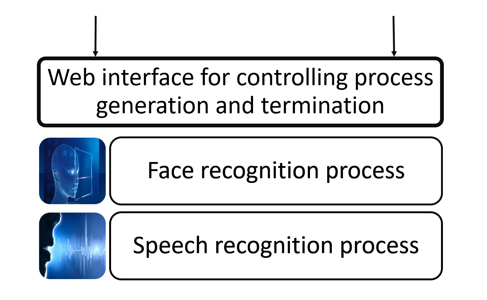
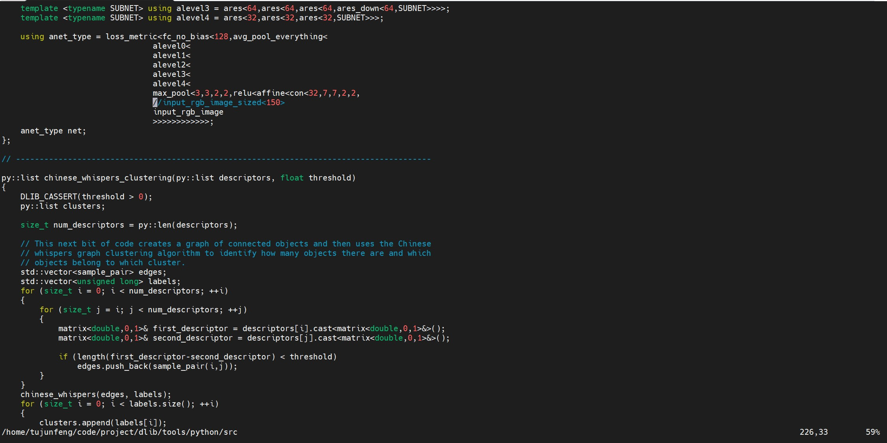

# video-context-analyze

## 目录:

+ [项目介绍](#项目介绍)
+ [项目框架图](#项目框架图)
+ [项目依赖](#项目依赖)
  + [mysql依赖](#mysql依赖)
  + [linux环境依赖](#linux环境依赖)
+ [项目亮点](#项目亮点)
+ [config.json文件介绍](#config.json文件介绍)
+ [启动](#启动)
+ [权限说明](#权限说明)

----

## 项目介绍

本项目实现对视频内容的实时检测（人脸和语音），项目基于python语言完成，借助于python的dlib、tornado和百度普通话语音识别api等第三方框架实现，项目可实现多路视频并行检测（基于multiprocess库实现）。

本项目在2080Ti-12G版显卡上测试最多并发5路视频，TelsaV100-32G版显卡上测试最多并发12路，并发性能良好，识别速度在2080Ti显卡上控制在10帧/s可基本实现实时检测，在V100上不用跳帧操作也可实现实时检测。

该项目不仅能实现对本地视频的实时检测，也能实现对实时直播流视频的实时检测，其可任意添加模块（可自由添加nfsw等模块）

**注意**：本项目为后端识别项目，前端相关代码由另外一位大佬负责编写，项目地址:[front-end-of-video-context-analyze-system](https://github.com/liujilong0116/front-end-of-video-context-analyze-system)

## 项目框架图：




## 项目依赖

### mysql依赖：

整个项目中依赖mysql数据库作为最终识别结果的存储区域，同时还需要几个固定的mysql数据表作为原始数据的支撑，下面将做一一介绍：

进入mysql以后新建database:
**开启xxx用户远程登录权限！**

> create database projectdata;

#### 1. movie table:

用于存放视频路径和视频对应id的表

**为什么需要这个表？**

因为在整个后端的设计中，需要对每一个进程进行独立控制，此时在进程控制的主进程里必须手持一个对应进程的id，否则根本无法控制。可能有些人会说直接拿video-name不就行了，但是video-name里可能是个绝对路径，这个值过于长而且臃肿，过我选择另取别名id作为替代，读者也可选择使用video-name作为hold变量，不过此时读者得自行修改代码。

>create table video(num BIGINT not null auto_increment primary key, video_id varchar(512) not null, video_path varchar(512) not null);

#### 2. face_feature table:

用于存放已知人脸的特征值，因为dlib进行人脸识别的过程是先生成人脸特征值然后进行欧氏距离对比的方式，所以你需要这个表作为初始化人脸特征值的基准表

> create table face_feature (id BIGINT not null auto_increment primary key, name varchar(1024) not null, feature varchar(15000) not null );

#### 3. record table:

用于存放识别结果的表，该表为后端必须表

> create table record (id BIGINT not null auto_increment primary key, video_id VARCHAR(1024) not null, start VARCHAR(1024) not null, end VARCHAR(1024) not null, person_name VARCHAR(1024) not null, save_file VARCHAR(4096) not null unique, mode set('face', 'word', 'audio', 'banner', 'logo'));

#### 4. people table:

用于存放人名和对应的人的职位等信息，该表主要是配合前端的增删改查，与后端无关。**后续表单皆为前端需要使用的表**

> create table people(id BIGINT not null auto_increment primary key, people_name varchar(255), people_position varchar(255), fall_time varchar(255), fall_reason varchar(255));

#### 5. image table:

用于存放人名和对应的人图片路径、来源等，该表主要是配合前端的增删改查，与后端无关

>  create table people(id BIGINT not null auto_increment primary key, people_name varchar(255), path_position varchar(255),url longtext);

#### 6. tv table:

用于存放直播源路径，你需要自己寻找m3u8类型的直播源url然后存入表中

> create table tv(id BIGINT not null auto_increment primary key, tv_name varchar(255), tv_url  varchar(255), tv_icon_path varchar(255))

### linux基础环境依赖

1.安装cuda10.0+cudnn7.6.5以上版本

参考网上教程，略

2.安装docker

参考网上教程，略

**注意：**需要使用docker的原因是项目中包含对视频的显示工作，本项目采用一套推流的方案进行视频远程显示，借助于第三方的docker镜像（主要是方便），此处方法借鉴本人师兄做法（项目中部分代码有与其相似的地方，本项目主打的是**多路视频检测，异步视频处理，异步处理进程控制**）

3.ffmpeg和python环境

> sudo apt install ffmpeg 
>
> pip install -r requirements.txt

4.dlib

你需要手动下载[dlib代码](https://github.com/davisking/dlib.git)然后编译安装，编译中，因为涉及中文人脸的识别模型，你需要手动修改其中一行代码：

dlib/tools/python/src/face_recognition.py



然后运行:

> cd path/to/dlib/
>
> mkdir build
>
> cd build
>
> cmake ..
>
> make -j8 
>
> sudo make install

## 项目亮点

本项目最主要的自主创新点在于实现了一种对于多进程的控制，客户端可**任意增删查**后台进程，仅需要通过C-S沟通video_id即可实现，后台进程对于进程的控制类似交换机，可实现**异步**定位，同时具备**高并发**响应客户端，这得益于tornado框架的高并发性。

项目中人脸识别准确率相对较高，在正常情况下可根据阈值自行调节，语音识别需要在互联网联通的情况下运行。

## config.json文件介绍

```json
由于json文件不支持注释功能，所以在此注释讲解
{
  # 百度语音识别时需要的token
  "api_key" : "xxxxxxxxxxxxxxxxxxxx",
  "secret_key": "xxxxxxxxxxxxxxxxxxxxxxxxxx",
  "dev_pid": 1537,
  
  # 识别结果保存的路径
  "output_dir": "output/",
  
  # 后端进程的主机ip以及其mysql配置
  "host_name": "xxxxx",
  "mysql_user": "xxxxx",
  "mysql_passwd": "xxxxx",
  "mysql_database": "xxxxxx",
  "mysql_port": 3306,
  "mysql_table": "record",
  
  # 你的代码路径，填绝对路径。
  "code_dir": "path/to/video-context-analyze" ,
  
  # video存放的路径
  "video_root_path": "/path/to/videos",
  
  # image存放的路径
  "image_root_path": "/path/to/images",
  
  # 已弃用
  "c_r_proportion": 5,
  # 人脸识别的阈值，越小表示识别的门槛越高
  "threshold": 0.5,
  # 跳帧数
  "video_len": 4,
  # 语音片段裁剪的长短，94286大概是3s
  "audio_len": 94286,
  # 视频中图像固定的尺寸
  "width": 1280,
  "height": 720,
  
  # 模块是否开启，人脸识别模块 fr, 语音识别模块 sr
  "fr": "on",
  "sr": "on"
}
请读者自行配置相关参数调节
```

## 启动

> docker pull illuspas/node-media-server
>
> docker run -d --network bridge --name media-server -p 1935:1935 -p 8500:8500 -v PATH/TO/YOUR/video/:/usr/src/app/video -v PATH/TO/CODE/Node-Media-Server/app.js:/usr/src/app/app.js -v PATH/TO/CODE/Node-Media-server/node_relay_server.js:/usr/src/app/node_relay_server.js -v PATH/TO/CODE/Node-Media-server/privatekey.pem:/privatekey.pem -v PATH/TO/CODE/Node-Media-server/certificate.pem:/certificate.pem illuspas/node-media-server:latest
>
> python main.py
>
> 等待客户端响应即可，余下操作请阅读前端使用手册

## 权限说明

**感谢提供思路的老师师兄以及解决方案的第三方python库，开源许可证为MIT，请需要读者根据MIT许可证许可条件自行开发使用**

#### 新增对于控制器的讲解：[控制器讲解]()
